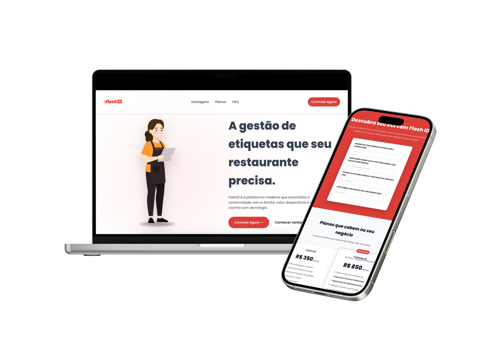

# Calculadora de ROI - Flash ID

> Uma landing page interativa para um SaaS de gestão de etiquetas para restaurantes, incluindo uma calculadora para simular a economia gerada pela redução de desperdício de alimentos.

## 📜 Sobre o Projeto

Este projeto é a vitrine do **Flash ID**, um sistema SaaS projetado para otimizar a gestão de etiquetas em restaurantes, focando na prevenção de perdas por validade. O site não apenas apresenta a solução, mas também oferece uma ferramenta de valor imediato: uma **calculadora de Retorno sobre o Investimento (ROI)**. Com ela, potenciais clientes podem simular os custos atuais com perdas de alimentos e visualizar a economia que o Flash ID pode proporcionar.

## ✨ Funcionalidades

-   **Landing Page Responsiva:** Apresentação clara da proposta de valor do SaaS.
-   **Calculadora de ROI Interativa:** Ferramenta para calcular perdas com alimentos vencidos e o potencial de economia.
-   **Design Moderno:** Interface construída com React e estilizada para uma experiência de usuário agradável.
-   **Animações com CSS:** Elementos animados para tornar a navegação mais dinâmica.

## 🛠️ Tecnologias Utilizadas

-   **Frontend:** React.js
-   **Build Tool:** Vite
-   **Estilização:** CSS puro com Variáveis CSS
-   **Linguagem:** JavaScript (JSX)
